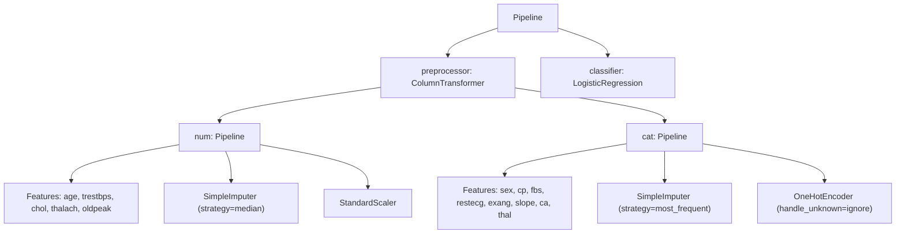

#  **Heart Disease Prediction**
#
# **What this notebook contains (high-level)**
- Problem statement and dataset loading
- Exploratory Data Analysis (EDA)
- Preprocessing with reusable `Pipeline` and `ColumnTransformer`
- Model training & comparison (LogisticRegression, RandomForest, optionally XGBoost)
- Robust evaluation: Stratified K-Fold CV, ROC/AUC, Precision/Recall, Confusion Matrix
- Model interpretation: SHAP (global + local explanations) and feature importance
- Calibration check, saved artifacts, and concise conclusion + next steps
#


#  1) Environment & imports


```python
import os
import sys
import warnings
from pathlib import Path

warnings.filterwarnings('ignore')

# Basic data + ML
import numpy as np
import pandas as pd

# Plotting
import matplotlib.pyplot as plt
from sklearn.metrics import (
    accuracy_score, precision_score, recall_score, f1_score,
    roc_auc_score, roc_curve, precision_recall_curve, confusion_matrix,
    classification_report, average_precision_score
)

# Modeling
from sklearn.model_selection import train_test_split, StratifiedKFold, cross_val_score
from sklearn.pipeline import Pipeline
from sklearn.compose import ColumnTransformer
from sklearn.preprocessing import StandardScaler, OneHotEncoder
from sklearn.impute import SimpleImputer
from sklearn.linear_model import LogisticRegression
from sklearn.ensemble import RandomForestClassifier

# Utilities
import joblib

print("Libraries loaded")
```

    Libraries loaded
    

# 2) Load data


```python
possible_paths = [
    '/mnt/data/heart.csv',
    '/mnt/data/Heart.csv',
    '/mnt/data/heart_disease.csv',
    'heart.csv',
    'Heart.csv',
    'heart_disease.csv'
]

data_path = None
for p in possible_paths:
    if Path(p).exists():
        data_path = p
        break

if data_path is None:
    raise FileNotFoundError(
        "Could not find dataset automatically. Please set `data_path` to your CSV file path (e.g. '/mnt/data/heart.csv')."
    )

print(f"Loading dataset from: {data_path}")

data = pd.read_csv(data_path)

print("Dataset loaded. Shape:", data.shape)
```

    Loading dataset from: heart.csv
    Dataset loaded. Shape: (303, 14)
    

#  Quick peek at the dataset


```python
# Show top rows and basic info
pd.set_option('display.max_columns', None)
print(data.head())
print('\nInfo:')
print(data.info())
print('\nMissing values per column:')
print(data.isna().sum())
```

       age  sex  cp  trestbps  chol  fbs  restecg  thalach  exang  oldpeak  slope  \
    0   63    1   3       145   233    1        0      150      0      2.3      0   
    1   37    1   2       130   250    0        1      187      0      3.5      0   
    2   41    0   1       130   204    0        0      172      0      1.4      2   
    3   56    1   1       120   236    0        1      178      0      0.8      2   
    4   57    0   0       120   354    0        1      163      1      0.6      2   
    
       ca  thal  target  
    0   0     1       1  
    1   0     2       1  
    2   0     2       1  
    3   0     2       1  
    4   0     2       1  
    
    Info:
    <class 'pandas.core.frame.DataFrame'>
    RangeIndex: 303 entries, 0 to 302
    Data columns (total 14 columns):
     #   Column    Non-Null Count  Dtype  
    ---  ------    --------------  -----  
     0   age       303 non-null    int64  
     1   sex       303 non-null    int64  
     2   cp        303 non-null    int64  
     3   trestbps  303 non-null    int64  
     4   chol      303 non-null    int64  
     5   fbs       303 non-null    int64  
     6   restecg   303 non-null    int64  
     7   thalach   303 non-null    int64  
     8   exang     303 non-null    int64  
     9   oldpeak   303 non-null    float64
     10  slope     303 non-null    int64  
     11  ca        303 non-null    int64  
     12  thal      303 non-null    int64  
     13  target    303 non-null    int64  
    dtypes: float64(1), int64(13)
    memory usage: 33.3 KB
    None
    
    Missing values per column:
    age         0
    sex         0
    cp          0
    trestbps    0
    chol        0
    fbs         0
    restecg     0
    thalach     0
    exang       0
    oldpeak     0
    slope       0
    ca          0
    thal        0
    target      0
    dtype: int64
    

# 3) Quick EDA


```python
# Target column detection: try common names
possible_target_cols = ['target', 'diagnosis', 'heart_disease', 'disease', 'output']

target_col = None
for c in possible_target_cols:
    if c in data.columns:
        target_col = c
        break

# If not found, assume last column is target (common in UCI csvs)
if target_col is None:
    target_col = data.columns[-1]

print(f"Using '{target_col}' as the target column")

# Convert target to integer 0/1 if possible
if not pd.api.types.is_integer_dtype(data[target_col]):
    data[target_col] = data[target_col].astype(int)
```

    Using 'target' as the target column
    


```python
# Convert target to integer 0/1 if possible
if not pd.api.types.is_integer_dtype(data[target_col]):
    data[target_col] = data[target_col].astype(int)

# Class balance
print('\nClass distribution:')
print(data[target_col].value_counts(normalize=True).rename('proportion'))

# Plot class balance
plt.figure(figsize=(5,4))
data[target_col].value_counts().plot(kind='bar')
plt.title('Class counts')
plt.xlabel('Target')
plt.ylabel('Count')
plt.show()
```

    
    Class distribution:
    target
    1    0.544554
    0    0.455446
    Name: proportion, dtype: float64
    


    

    


```python
# Numeric feature distributions: show histogram for top numeric columns
numeric_cols = data.select_dtypes(include=[np.number]).columns.tolist()
if target_col in numeric_cols:
    numeric_cols.remove(target_col)

print('\nNumeric columns:', numeric_cols)

# Show histograms for up to 8 numeric cols
n_to_plot = min(len(numeric_cols), 8)
plt.style.use('default')
fig, axes = plt.subplots(n_to_plot, 1, figsize=(6, 3*n_to_plot))
for i, col in enumerate(numeric_cols[:n_to_plot]):
    ax = axes[i]
    ax.hist(data[col].dropna(), bins=30)
    ax.set_title(f'Distribution: {col}')
plt.tight_layout()
plt.show()
```

    
    Numeric columns: ['age', 'sex', 'cp', 'trestbps', 'chol', 'fbs', 'restecg', 'thalach', 'exang', 'oldpeak', 'slope', 'ca', 'thal']
    


    

    


```python
# Correlation heatmap (numeric features)
try:
    import seaborn as sns
    plt.figure(figsize=(10,8))
    sns.heatmap(data[numeric_cols + [target_col]].corr(), annot=True, fmt='.2f', cmap='coolwarm')
    plt.title('Correlation matrix')
    plt.show()
except Exception:
    print('Seaborn not available — skipping heatmap')

```


    

    


 # 4) Train / Test split


```python
X = data.drop(columns=[target_col])
y = data[target_col]

# Stratified split to keep class balance
X_train, X_test, y_train, y_test = train_test_split(
    X, y, test_size=0.2, random_state=42, stratify=y
)

print('Train shape:', X_train.shape, 'Test shape:', X_test.shape)
```

    Train shape: (242, 13) Test shape: (61, 13)
    

# 5) Preprocessing pipeline (robust, reproducible)


```python
# Heuristic: treat object/ category dtype and low unique-count numeric columns as categorical
cat_cols = X.select_dtypes(include=['object', 'category']).columns.tolist()
num_cols = X.select_dtypes(include=[np.number]).columns.tolist()

```


```python
# Treat low-cardinality numeric columns (<= 10 unique) as categorical (e.g., 'cp', 'thal')
for c in num_cols.copy():
    if X[c].nunique() <= 10:
        cat_cols.append(c)
        num_cols.remove(c)

print('Numeric columns used:', num_cols)
print('Categorical columns used:', cat_cols)
```

    Numeric columns used: ['age', 'trestbps', 'chol', 'thalach', 'oldpeak']
    Categorical columns used: ['sex', 'cp', 'fbs', 'restecg', 'exang', 'slope', 'ca', 'thal']
    


```python
# Build transformers
numeric_transformer = Pipeline(steps=[
    ('imputer', SimpleImputer(strategy='median')),
    ('scaler', StandardScaler())
])

categorical_transformer = Pipeline(steps=[
    ('imputer', SimpleImputer(strategy='most_frequent')),
    ('onehot', OneHotEncoder(handle_unknown='ignore'))
])

preprocessor = ColumnTransformer(transformers=[
    ('num', numeric_transformer, num_cols),
    ('cat', categorical_transformer, cat_cols)
])
```

# 6) Model training: baseline and comparison


```python
# Create pipelines for each model so the entire process is reproducible
pipelines = {
    'logreg': Pipeline(steps=[('preprocessor', preprocessor), ('classifier', LogisticRegression(max_iter=1000, random_state=42))]),
    'rf': Pipeline(steps=[('preprocessor', preprocessor), ('classifier', RandomForestClassifier(n_estimators=200, random_state=42))])
}

```


```python
# Try adding XGBoost if available
try:
    from xgboost import XGBClassifier
    pipelines['xgb'] = Pipeline(steps=[('preprocessor', preprocessor), ('classifier', XGBClassifier(use_label_encoder=False, eval_metric='logloss', random_state=42))])
    print('XGBoost available — added to model list')
except Exception:
    print('XGBoost not installed — skipping')
```

    XGBoost not installed — skipping
    


```python
# Quick cross-validated comparison (ROC AUC)
cv = StratifiedKFold(n_splits=5, shuffle=True, random_state=42)
cv_results = {}
for name, pipe in pipelines.items():
    scores = cross_val_score(pipe, X_train, y_train, cv=cv, scoring='roc_auc')
    cv_results[name] = scores
    print(f"{name}: mean ROC AUC = {scores.mean():.4f} ± {scores.std():.4f}")

```

    logreg: mean ROC AUC = 0.8904 ± 0.0355
    rf: mean ROC AUC = 0.8846 ± 0.0621
    


# (Optional) Hyperparameter Tuning with GridSearchCV
- To Demonstrate how to tune a RandomForest using a small grid.
.


```python
from sklearn.model_selection import GridSearchCV

param_grid = {
    'classifier__n_estimators': [100, 200],
    'classifier__max_depth': [None, 5, 10],
    'classifier__min_samples_split': [2, 5]
}

rf_pipe = Pipeline(steps=[('preprocessor', preprocessor),
                          ('classifier', RandomForestClassifier(random_state=42))])

grid_search = GridSearchCV(
    rf_pipe, param_grid, cv=3, scoring='roc_auc', n_jobs=-1, verbose=1
)
grid_search.fit(X_train, y_train)

print("Best parameters:", grid_search.best_params_)
print("Best CV ROC AUC:", grid_search.best_score_)

# Update best model if needed
best_pipe = grid_search.best_estimator_

```

    Fitting 3 folds for each of 12 candidates, totalling 36 fits
    Best parameters: {'classifier__max_depth': None, 'classifier__min_samples_split': 5, 'classifier__n_estimators': 100}
    Best CV ROC AUC: 0.9082036582036582
    

# 7) Fit best model on full training set and evaluate on test set


```python
# Choose best model by mean CV AUC
best_model_name = max(cv_results, key=lambda k: cv_results[k].mean())
print('Best model by CV AUC:', best_model_name)

best_pipe = pipelines[best_model_name]
best_pipe.fit(X_train, y_train)
```

    Best model by CV AUC: logreg
    



```python
# Test set predictions
y_pred = best_pipe.predict(X_test)
y_proba = best_pipe.predict_proba(X_test)[:, 1]

print('\nTest set metrics:')
print('Accuracy:', accuracy_score(y_test, y_pred))
print('Precision:', precision_score(y_test, y_pred))
print('Recall:', recall_score(y_test, y_pred))
print('F1:', f1_score(y_test, y_pred))
print('ROC AUC:', roc_auc_score(y_test, y_proba))
print('\nClassification Report:')
print(classification_report(y_test, y_pred))
```

    
    Test set metrics:
    Accuracy: 0.8688524590163934
    Precision: 0.8571428571428571
    Recall: 0.9090909090909091
    F1: 0.8823529411764706
    ROC AUC: 0.9101731601731602
    
    Classification Report:
                  precision    recall  f1-score   support
    
               0       0.88      0.82      0.85        28
               1       0.86      0.91      0.88        33
    
        accuracy                           0.87        61
       macro avg       0.87      0.87      0.87        61
    weighted avg       0.87      0.87      0.87        61
    
    

# Confusion matrix


```python
cm = confusion_matrix(y_test, y_pred)
plt.figure(figsize=(4,3))
plt.imshow(cm, interpolation='nearest')
plt.title('Confusion matrix')
plt.colorbar()
plt.xticks([0,1])
plt.yticks([0,1])
plt.xlabel('Predicted')
plt.ylabel('Actual')
for i in range(cm.shape[0]):
    for j in range(cm.shape[1]):
        plt.text(j, i, cm[i, j], ha='center', va='center', color='white')
plt.show()
```


    

    


# ROC curve


```python
fpr, tpr, _ = roc_curve(y_test, y_proba)
plt.figure(figsize=(6,4))
plt.plot(fpr, tpr)
plt.plot([0,1], [0,1], linestyle='--')
plt.xlabel('False Positive Rate')
plt.ylabel('True Positive Rate')
plt.title('ROC curve — Test set')
plt.show()
```


    

    


# Precision-Recall curve


```python
precision, recall, _ = precision_recall_curve(y_test, y_proba)
avg_prec = average_precision_score(y_test, y_proba)
plt.figure(figsize=(6,4))
plt.plot(recall, precision)
plt.xlabel('Recall')
plt.ylabel('Precision')
plt.title(f'Precision-Recall curve — AP={avg_prec:.3f}')
plt.show()
```


    

    


#  8) Calibration check (optional but useful in healthcare contexts)


```python
from sklearn.calibration import calibration_curve
prob_true, prob_pred = calibration_curve(y_test, y_proba, n_bins=10)
plt.figure(figsize=(6,4))
plt.plot(prob_pred, prob_true, marker='o')
plt.plot([0,1], [0,1], linestyle='--')
plt.xlabel('Predicted probability')
plt.ylabel('True probability')
plt.title('Calibration plot')
plt.show()
```


    

    


# 9) Feature importance & Explainability (SHAP)


```python
# We'll try to use TreeExplainer for tree models (RF/XGB). For non-tree models, we fall back to KernelExplainer.
try:
    import shap
    shap.initjs()
    print('SHAP installed')
except Exception:
    shap = None
    print('SHAP not installed — skip explainability section')
```

    SHAP not installed — skip explainability section
    


```python
if shap is not None:
    # Prepare a clean dataframe for SHAP
    X_shap = X_test.copy()
    final_estimator = best_pipe.named_steps['classifier']

    # Get feature names after preprocessing
    num_features = num_cols
    cat_ohe = best_pipe.named_steps['preprocessor'].named_transformers_['cat'].named_steps['onehot']
    cat_feature_names = list(cat_ohe.get_feature_names_out(cat_cols))
    feature_names = num_features + cat_feature_names

    if hasattr(final_estimator, 'feature_importances_'):
        # ---- TreeExplainer (RandomForest / XGBoost) ----
        explainer = shap.TreeExplainer(final_estimator, feature_perturbation='tree_path_dependent')
        transformed_X_test = best_pipe.named_steps['preprocessor'].transform(X_test)
        shap_values = explainer.shap_values(transformed_X_test)

        try:
            sv = shap_values[1] if isinstance(shap_values, list) else shap_values
            shap.summary_plot(sv, transformed_X_test, feature_names=feature_names, plot_type='bar')
        except Exception as e:
            print('Could not produce SHAP bar plot:', e)

        # Waterfall for one example
        try:
            idx = 0
            if isinstance(sv, np.ndarray):
                shap.plots._waterfall.waterfall_legacy(explainer.expected_value, sv[idx], feature_names=feature_names)
        except Exception:
            pass

    else:
        # ---- KernelExplainer (Logistic Regression, etc.) ----
        print('Using KernelExplainer (may be slow). Taking a small background sample...')

        background = X_train.sample(n=min(50, X_train.shape[0]), random_state=42)
        background_processed = best_pipe.named_steps['preprocessor'].transform(background)
        X_shap_proc = best_pipe.named_steps['preprocessor'].transform(X_shap)

        def predict_fn(x):
            return best_pipe.named_steps['classifier'].predict_proba(x)

        try:
            kernel_explainer = shap.KernelExplainer(predict_fn, background_processed)
            shap_values = kernel_explainer.shap_values(X_shap_proc[:50])  # limit for speed
            sv = shap_values[1] if isinstance(shap_values, list) else shap_values
            shap.summary_plot(sv, X_shap_proc[:50], feature_names=feature_names, plot_type='bar')
        except Exception as e:
            print('KernelExplainer failed or too slow:', e)

```

# 10) Save artifacts & reproducibility


```python
artifacts_dir = Path('artifacts')
artifacts_dir.mkdir(exist_ok=True)

# Save best pipeline
joblib.dump(best_pipe, artifacts_dir / f'best_pipeline_{best_model_name}.joblib')
print('Saved best pipeline to', artifacts_dir / f'best_pipeline_{best_model_name}.joblib')

# Save a CSV of test predictions for review
results_df = X_test.copy()
results_df['y_true'] = y_test.values
results_df['y_pred'] = y_pred
results_df['y_proba'] = y_proba
results_df.to_csv(artifacts_dir / 'test_predictions.csv', index=False)
print('Saved test predictions to artifacts/test_predictions.csv')

```

    Saved best pipeline to artifacts\best_pipeline_logreg.joblib
    Saved test predictions to artifacts/test_predictions.csv
    

# 11) Conclusion & interview talking points

- **Problem**: binary classification (heart disease yes/no)
- **Approach**: clean preprocessing with `ColumnTransformer`, model comparison with cross-validation, and robust evaluation using ROC/AUC and PR curves.
- **Explainability**: SHAP (TreeExplainer) for global and local interpretation — discussed important features and provided force/waterfall plots for sample predictions.
- **Production considerations**: data drift monitoring, model calibration, privacy, and clinical validation are critical next steps.

# **What to mention in an interview**:
1. Why you chose the preprocessing steps (median imputation, standard scaling for continuous variables, one-hot for categorical).
2. Why stratified splitting and cross-validation were used.
3. The metrics you used and why (ROC AUC for ranking, precision/recall for class imbalance, calibration for probabilistic outputs in healthcare).
4. How explainability (SHAP) supports trust with clinicians.
5. Limitations and future work (more data, external validation, bias checks, calibration, model monitoring).

