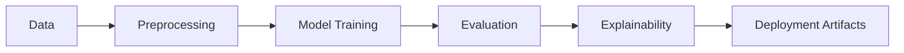

# 🫀 Heart Disease Prediction using Machine Learning  


## 📌 Description  
Heart disease is one of the leading causes of mortality worldwide. Early prediction can significantly improve patient outcomes by enabling timely diagnosis and preventive measures.  

This project builds a **binary classification model** to predict whether a patient has heart disease, using structured clinical data. The pipeline includes **data preprocessing, model training, evaluation, and interpretability** techniques, ensuring the model is both accurate and trustworthy.  

---

## 🚀 Key Features  
- **Dataset Preprocessing** with `Pipeline` and `ColumnTransformer`  
- **Imbalanced Data Handling** (Stratified split, CV evaluation)  
- **Model Training & Comparison**: Logistic Regression, Random Forest, and optional XGBoost  
- **Robust Evaluation**: ROC-AUC, F1-score, Precision-Recall curves  
- **Explainability**: SHAP feature importance and local explanations  
- **Model Calibration** for reliable probability predictions  
- **Artifacts Saved**: trained pipeline + test predictions  

---

## 🏗️ Architecture Overview  


---

## ⚙️ Tech Stack / Tools  
- **Python** (NumPy, Pandas, Matplotlib, Seaborn)  
- **Scikit-learn** (Pipelines, Logistic Regression, Random Forest)  
- **Joblib** (Model saving)  
- **SHAP** (Interpretability, optional)  
- **Jupyter Notebook** (Experiments & documentation)  

---

## 📊 Dataset Information  
- **Source**: [UCI Heart Disease Dataset](https://archive.ics.uci.edu/ml/datasets/heart+Disease)  
- **Size**: 303 samples × 14 features  
- **Target**: `1 = Disease`, `0 = No Disease`  
- **Preprocessing**:  
  - Median imputation for numeric features  
  - Most frequent imputation for categorical  
  - Standard scaling (numeric)  
  - One-hot encoding (categorical)  

---

## 🛠️ Installation & Requirements  
```bash
git clone <your-repo-url>
cd HeartDiseasePrediction
pip install -r requirements.txt
```

**Dependencies**  
- numpy  
- pandas  
- scikit-learn  
- matplotlib  
- seaborn  
- shap (optional)  
- joblib  

---

## ▶️ Usage Instructions  
**Training & Evaluation**  
```bash
jupyter notebook HeartDiseasePrediction.ipynb
```

**Inference with Saved Model**  
```python
import joblib
model = joblib.load("artifacts/best_pipeline_logreg.joblib")
pred = model.predict(new_data)  # new_data must be preprocessed format
```

---

## 📈 Results & Performance  
| Metric       | Score  |
|--------------|--------|
| Accuracy     | 86.9%  |
| Precision    | 85.7%  |
| Recall       | 90.9%  |
| F1-score     | 88.2%  |
| ROC-AUC      | 0.91   |

**Visualizations:**  
- Class balance  
- Confusion Matrix  
- ROC Curve  
- Precision-Recall Curve  
- Calibration Plot  

---

## 🌍 Applications & Impact  
- Assist healthcare professionals in **early screening** of heart disease.  
- Can be integrated into **clinical decision support systems**.  
- Provides **transparent and explainable predictions** with SHAP.  

---

## ⚠️ Limitations & Future Work  
- [ ] Small dataset size (303 samples).  
- [ ] External validation needed on clinical data.  
- [ ] Could benefit from **deep learning** or **ensemble methods**.  
- [ ] Mobile deployment & real-time monitoring.  

---

## 📂 Project Structure  
```
HeartDiseasePrediction/
│── HeartDiseasePrediction.ipynb   # Main notebook
│── README.md
│── LICENSE
```

---

## 🤝 Contributing  
Pull requests are welcome! For major changes, please open an issue first.  

---

## 📜 License  
MIT License  

---

## 🙏 Acknowledgments  
- [UCI Heart Disease Dataset](https://archive.ics.uci.edu/ml/datasets/heart+Disease)  
- [Scikit-learn Documentation](https://scikit-learn.org/)  
- [SHAP Library](https://shap.readthedocs.io/en/latest/)  
