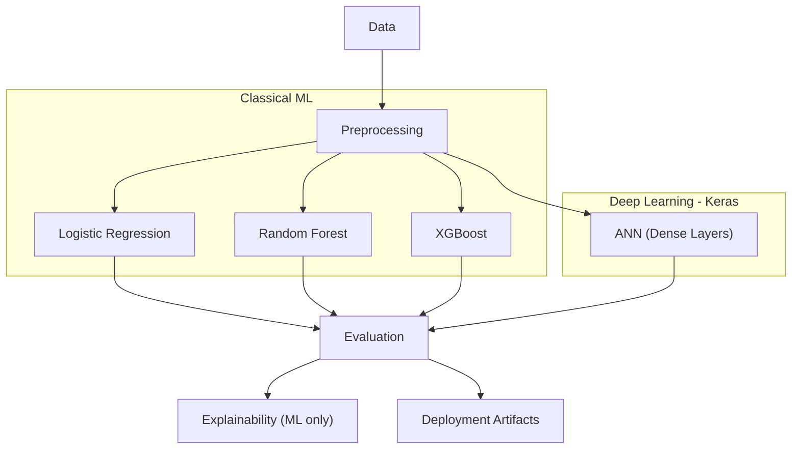

# 🫀 Heart Disease Prediction using Machine Learning & Deep Learning  


## 📌 Description  
Heart disease remains one of the leading causes of mortality worldwide. Early detection can significantly improve patient outcomes by enabling timely diagnosis and preventive measures.  

This project builds **two complementary approaches** to predict heart disease:  
1. **Classical Machine Learning models** (Logistic Regression, Random Forest, XGBoost) with explainability and calibration.  
2. **Deep Learning model (Keras ANN)** using TensorFlow with data balancing (SMOTE) and EarlyStopping.  

The combination of ML and DL allows us to compare interpretability vs. flexibility in predictive modeling.  

---

## 🚀 Key Features  

### 🔹 Machine Learning Pipeline  
- **Dataset Preprocessing** with `Pipeline` and `ColumnTransformer`  
- **Imbalanced Data Handling** (Stratified split, CV evaluation)  
- **Model Training & Comparison**: Logistic Regression, Random Forest, and optional XGBoost  
- **Robust Evaluation**: ROC-AUC, F1-score, Precision-Recall curves  
- **Explainability**: SHAP feature importance and local explanations  
- **Model Calibration** for reliable probability predictions  
- **Artifacts Saved**: trained pipeline + test predictions  

### 🔹 Deep Learning Pipeline (Keras ANN)  
- **StandardScaler** preprocessing  
- **SMOTE** applied for class imbalance  
- **Model Architecture**: Multi-layer Perceptron (Dense layers with ReLU + Sigmoid)  
- **Initialization**: He-uniform for better convergence  
- **Regularization**: EarlyStopping to avoid overfitting  
- **Evaluation**: Confusion Matrix, Classification Report, ROC Curve, AUC  

---

## 🏗️ Architecture Overview  



---

## ⚙️ Tech Stack / Tools  
- **Python** (NumPy, Pandas, Matplotlib, Seaborn)  
- **Scikit-learn** (Pipelines, Logistic Regression, Random Forest)  
- **TensorFlow / Keras** (ANN model)  
- **Imbalanced-learn** (SMOTE for handling imbalance)  
- **Joblib** (Model saving)  
- **SHAP** (Interpretability, optional)  
- **Jupyter Notebook** (Experiments & documentation)  

---

## 📊 Dataset Information  
- **Source**: [UCI Heart Disease Dataset](https://archive.ics.uci.edu/ml/datasets/heart+Disease)  
- **Size**: 303 samples × 14 features  
- **Target**: `1 = Disease`, `0 = No Disease`  

**Preprocessing:**  
- Median imputation for numeric features (ML pipeline)  
- Most frequent imputation for categorical (ML pipeline)  
- Standard scaling (numeric)  
- One-hot encoding (categorical, ML pipeline)  
- SMOTE oversampling (DL pipeline)  

---

## 🛠️ Installation & Requirements  
```bash
git clone <your-repo-url>
cd HeartDiseasePrediction
pip install -r requirements.txt
```

**Dependencies**  
- numpy  
- pandas  
- scikit-learn  
- matplotlib  
- seaborn  
- shap (optional)  
- joblib  
- tensorflow  
- imbalanced-learn  

---

## ▶️ Usage Instructions  

### 🔹 Run Classical ML Pipeline  
```bash
jupyter notebook HeartDiseasePrediction.ipynb
```

### 🔹 Run Deep Learning Model  
```bash
jupyter notebook Heart_Disease.ipynb
```

**Example Inference with ML Saved Model**  
```python
import joblib
model = joblib.load("artifacts/best_pipeline_logreg.joblib")
pred = model.predict(new_data)  # new_data must be preprocessed format
```

---

## 📈 Results & Performance  

| Model                | Accuracy | Precision | Recall | F1 | ROC-AUC |
|-----------------------|----------|-----------|--------|----|---------|
| Logistic Regression   | 86.9%    | 85.7%     | 90.9%  | 88.2% | 0.91 |
| Random Forest         | (evaluated, not selected) | — | — | — | — |
| XGBoost (optional)    | (evaluated, not selected) | — | — | — | — |


### 🔹 Deep Learning Model (ANN)  
| Model        | Accuracy | Precision | Recall | F1   | ROC-AUC |
|--------------|----------|-----------|--------|------|---------|
| ANN (Keras)  | 85.3%    | 85.0%     | 86.4%  | 85.7% | 0.91 |


**Visualizations:**  
- Class balance  
- Confusion Matrix (ML & DL)  
- ROC Curves  
- Precision-Recall Curves  
- Calibration Plot (ML only)  

---

## 🌍 Applications & Impact  
- Assist healthcare professionals in **early screening** of heart disease.  
- Can be integrated into **clinical decision support systems**.  
- Demonstrates the tradeoff between **explainability (ML)** and **flexibility (DL)**.  

---

## ⚠️ Limitations & Future Work  
- [ ] Small dataset size (303 samples).  
- [ ] External validation needed on real-world clinical data.  
- [ ] Deep learning model can benefit from more data + hyperparameter tuning.  
- [ ] Explore **1D CNNs** or **hybrid ensemble models**.  
- [ ] Potential for **mobile deployment & real-time monitoring**.  

---

## 📂 Project Structure  
```
HeartDiseasePrediction/
│── HeartDiseasePrediction.ipynb   # Classical ML models
│── Heart_Disease.ipynb            # Deep Learning (Keras ANN)
│── README.md
│── LICENSE
```

---

## 🤝 Contributing  
Pull requests are welcome! For major changes, please open an issue first.  

---

## 📜 License  
MIT License  

---

## 🙏 Acknowledgments  
- [UCI Heart Disease Dataset](https://archive.ics.uci.edu/ml/datasets/heart+Disease)  
- [Scikit-learn Documentation](https://scikit-learn.org/)  
- [TensorFlow Documentation](https://www.tensorflow.org/)  
- [SHAP Library](https://shap.readthedocs.io/en/latest/)  
